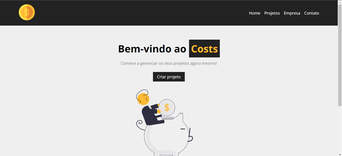
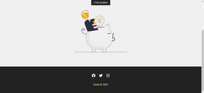
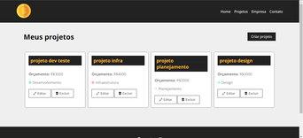
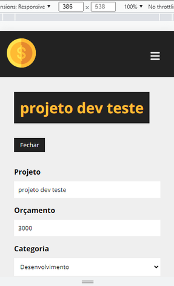
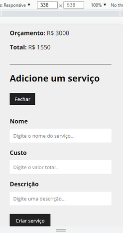
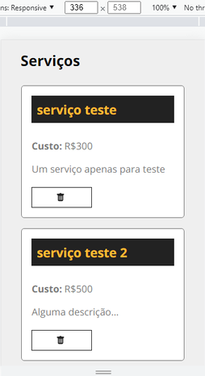
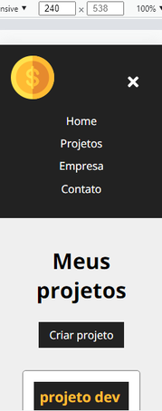

<p align='center'>
    
    
    
</p>

<h1 align='center'>Costs</h1>

<p align='center'>An application to manage project costs</p>

<p align='center'>
    <a href='#-about'>• About</a>
    <a href='#-screenshots'>• Screenshots</a>  
    <a href='#-functionalities'>• Functionalities</a>
    <a href='#-how-to-use'>• Get Started</a>  
    <a href='#-features'>• Features</a>  
    <a href='#-author'>• Author</a>  
    <a href='#-license'>• Licence</a>    
</p>

<p align='center'>🚀Project Completed ✅ </p>

## 💻 About

CRUD system in React and Json Server based on a React course from the ["Hora de Codar"](https://www.youtube.com/c/MatheusBattisti) channel that is on Youtube. The purpose of the project is to allow the user to manage project costs and services. 
## 🎨 Screenshots
### Desktop / Laptop 



### Mobile 





## Functionalities 
- [x] User can register, edit, list and remove projects
- [x] User can register, list and delete services associated with each project

## 🚀 Get Started
### Prerequisites
To start cloning, using and modifying this project you will need to have basic knowledge of HTML, CSS, JavaScript and GIT in addition to having installed on your machine [Node.Js](https://nodejs.org/en/), [NPM](https://www.npmjs.com/) and a code editor like Visual Studio Code.

### How to execute
Open your terminal and type: 

```bash 
     # Clone this repository
    $ git clone https://github.com/Gustavo-Victor/costs.git

    # Access the project folder through the terminal
    $ cd costs/

    # Install dependencies
    $ npm install

    # Start the json server to simulate the database on port 5000
    $ npm run backend 

    # Open another terminal tab and access the project folder to run the application
    $ cd costs/ 

    # Run the application
    $ npm start 

    # The application will open on port 3000 by default. Access in your browser: localhost:3000
    
```
## 🛠 Features

The following tools were used in the construction of the project:

### Languages 
- [HTML5](https://developer.mozilla.org/pt-BR/docs/Web/HTML)
- [CSS3](https://developer.mozilla.org/pt-BR/docs/Web/CSS)
- [JavaScript](https://www.javascript.com/) 
## Libraries and packages
- [React](https://pt-br.reactjs.org/)
    - [Create React App](https://create-react-app.dev/)
    - [React Icons](https://react-icons.github.io/react-icons/)
    - [React Router DOM](https://www.npmjs.com/package/react-router-dom)
    - [React Uuid](https://www.npmjs.com/package/react-uuid)
- [Json Server](https://www.npmjs.com/package/json-server)

See the file ['package.json'](./package.json)

### Utilities
- Fonts: [Open Sans](https://fonts.google.com/specimen/Open+Sans?query=Open+Sans)
- Editor: [Visual Studio Code](https://code.visualstudio.com/) 
- Markdown: [Markdown Emoji](https://gist.github.com/rxaviers/7360908)


## 🦸 Author
Made with ❤️ by Gustavo Souza. 👋 [Get in touch](https://www.linkedin.com/in/gustavo-victor-575b93206/)

- GitHub - [@Gustavo-Victor](https://github.com/Gustavo-Victor)
- Frontend Mentor - [@Gustavo-Victor](https://www.frontendmentor.io/profile/Gustavo-Victor)
- CodePen - [@gustavo_victor](https://codepen.io/gustavo_victor)
- Linkedin - [@gustavo-victor](https://www.linkedin.com/in/gustavo-victor-575b93206/)

## 📝 Licence 
This project is under the [MIT license](./LICENSE).

Anyone can use, clone, fork and contribute to this project.

